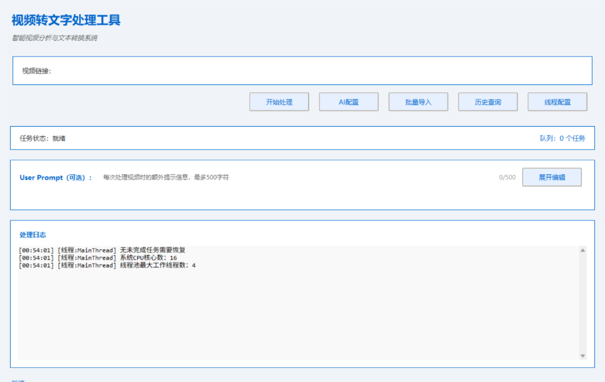
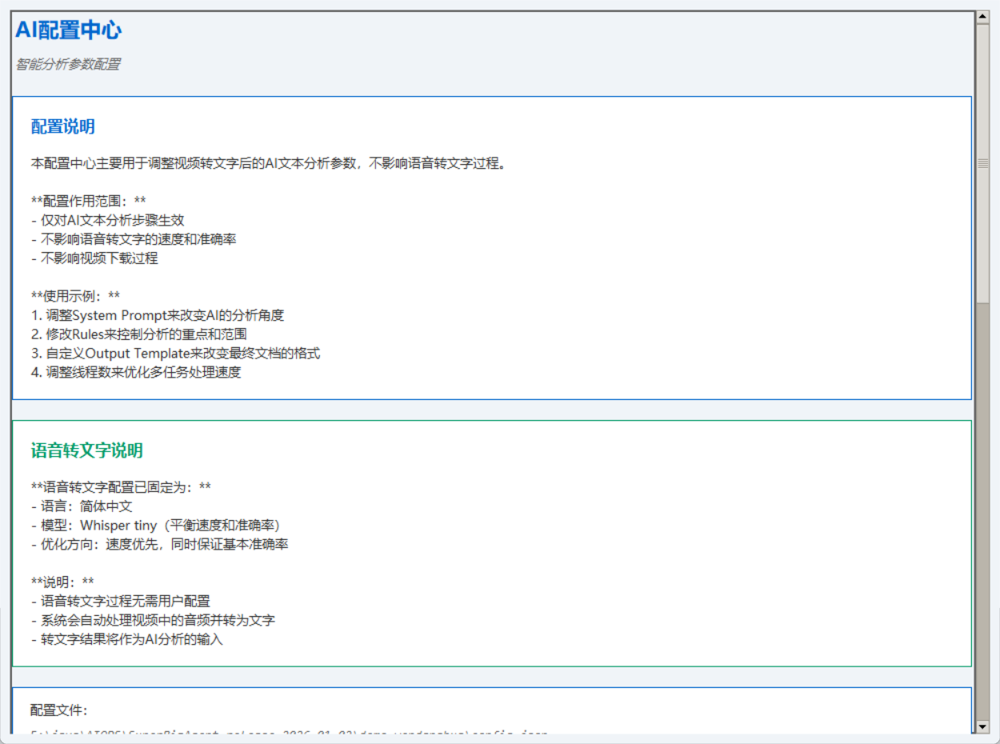
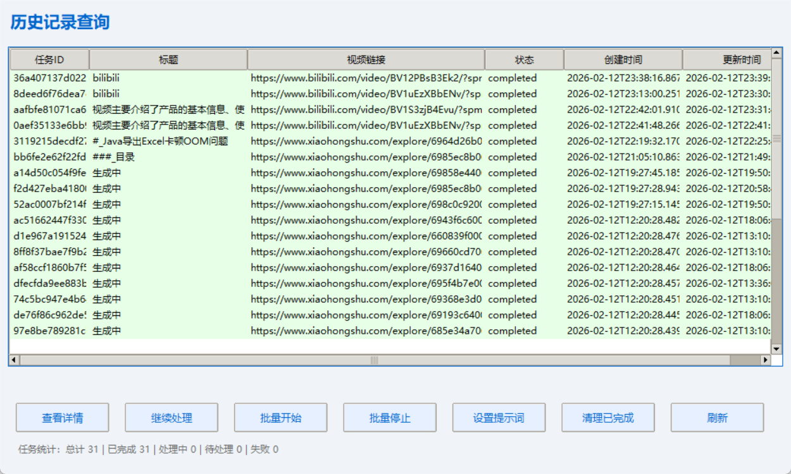

# 视频转文字处理工具

## 项目背景

随着视频内容的爆炸式增长，快速提取视频中的文字内容并进行智能分析变得越来越重要。本项目旨在提供一个高效、易用的视频转文字处理工具，支持多种视频平台（如B站、小红书等），能够自动下载视频、提取语音内容、进行AI智能分析，并生成结构化的Markdown文档。

## 项目技术栈

| 技术/框架 | 版本/说明 | 用途 | 版权信息 |
|---------|---------|------|--------|
| Python | 3.8+ | 核心开发语言 | [Python Software Foundation License](https://docs.python.org/3/license.html) |
| Tkinter | 内置 | 图形用户界面 | Python内置库 |
| Whisper | OpenAI | 语音转文字模型 | [MIT License](https://github.com/openai/whisper/blob/main/LICENSE) |
| yt-dlp | 最新版 | 视频下载工具 | [Unlicense](https://github.com/yt-dlp/yt-dlp/blob/master/LICENSE) |
| FFmpeg | 8.0.1 | 音频处理工具 | [LGPL v2.1](https://ffmpeg.org/legal.html) |
| 火山引擎API | - | AI文本分析 | 商业API，需要API密钥 |
| aiohttp | 最新版 | 异步HTTP客户端 | [Apache 2.0 License](https://github.com/aio-libs/aiohttp/blob/master/LICENSE.txt) |
| requests | 最新版 | HTTP客户端 | [Apache 2.0 License](https://github.com/psf/requests/blob/main/LICENSE) |
| numpy | 最新版 | 数值计算库 | [BSD License](https://numpy.org/license.html) |
| pandas | 最新版 | 数据处理库 | [BSD License](https://pandas.pydata.org/docs/getting_started/overview.html#license) |

## 项目功能

### 核心功能
- ✅ 视频链接解析与下载（支持B站、小红书等平台）
- ✅ 语音转文字（使用Whisper模型）
- ✅ AI智能文本分析与总结（使用火山引擎API）
- ✅ 自动生成结构化Markdown文档
- ✅ 历史记录管理与查询
- ✅ 批量视频处理
- ✅ 任务队列管理

### 高级特性
- 🚀 多线程并行处理
- 📁 视频与模型缓存机制
- 🔄 任务失败自动重试
- ⚡ 异步视频下载
- 🎯 链接查重与去重
- 📊 实时处理进度显示
- 📝 详细的日志记录

## 目录结构

```
demo_wendanghua/
├── Pictures/              # 文档图片目录
│   ├── 1.png              # 主界面截图
│   ├── 2.png              # AI配置界面截图
│   └── 3.png              # 历史查询界面截图
├── .gitignore             # Git忽略文件配置
├── requirements.txt       # 项目依赖
├── run_video_gui.bat      # 启动脚本
└── video_gui.py           # 主程序文件
```

## 安装部署

### 系统要求
- **操作系统**：Windows 10/11
- **Python版本**：3.8+
- **CPU**：至少4核心
- **内存**：至少8GB
- **磁盘空间**：至少5GB可用空间

### 安装步骤

#### 1. 克隆项目
```bash
git clone https://github.com/tangyu1719/VideoScribe.git
cd VideoScribe
```

#### 2. 安装依赖
```bash
pip install -r requirements.txt
```

#### 3. 配置FFmpeg
- 本项目需要FFmpeg工具用于音频处理
- 请从[FFmpeg官网](https://ffmpeg.org/download.html)下载并安装
- 确保 `ffmpeg.exe` 可执行文件在系统PATH中

#### 4. 配置API密钥

##### 火山引擎API配置
编辑 `video_gui.py` 文件，修改以下配置：

```python
# 火山引擎 API 配置
VOLCENGINE_API_KEY = "your_api_key_here"  # 替换为你的火山引擎API密钥
VOLCENGINE_API_URL = "https://ark.cn-beijing.volces.com/api/v3"  # 保持默认
```

## 使用方法

### 图形界面（推荐）
1. 双击运行 `run_video_gui.bat` 启动图形界面
2. 在"视频链接"输入框中粘贴视频链接（支持B站、小红书等）
3. （可选）在"User Prompt"中输入额外的处理提示信息
4. 点击"开始处理"按钮
5. 等待处理完成，结果会自动保存到 `output/` 目录
6. 点击"历史查询"查看所有处理过的任务

### 界面展示

#### 主界面


#### AI配置界面


#### 历史查询界面


### 批量处理
1. 准备包含视频链接的Excel文件
2. 点击"批量导入"按钮
3. 选择Excel文件
4. 设置批量处理参数
5. 点击"确认"开始批量处理

## 配置说明

### 核心配置

#### 语音转文字配置
- **模型**：使用Whisper tiny模型（平衡速度和准确率）
- **语言**：固定为简体中文
- **优化参数**：已在代码中设置最优参数，无需用户配置

#### AI分析配置
- **API**：使用火山引擎API
- **系统提示词**：控制AI的分析角度和风格
- **分析规则**：控制分析的重点和范围
- **输出模板**：控制最终文档的格式

## 常见问题与解决方案

### 1. 视频下载失败
- **原因**：网络连接问题、平台API限制、链接失效
- **解决方案**：
  - 检查网络连接
  - 确认视频链接有效
  - 尝试使用不同的浏览器获取链接
  - 对于B站视频，确保链接包含完整的BV号

### 2. 语音转文字失败
- **原因**：视频无音频轨道、Whisper模型加载失败、文件格式不支持
- **解决方案**：
  - 确认视频包含音频
  - 检查FFmpeg是否正确安装
  - 尝试使用较短的视频测试

### 3. AI分析失败
- **原因**：火山引擎API密钥无效、网络连接问题、请求超时
- **解决方案**：
  - 检查API密钥配置
  - 确保网络连接稳定
  - 减少视频长度或分段处理

### 4. 程序启动失败
- **原因**：依赖包缺失、Python版本不兼容、配置错误
- **解决方案**：
  - 重新安装依赖：`pip install -r requirements.txt`
  - 确保使用Python 3.8+
  - 检查配置文件格式

## 性能优化建议

1. **使用GPU加速**：安装CUDA版本的PyTorch以加速Whisper模型
2. **增加内存**：处理长视频时建议使用16GB以上内存
3. **优化线程数**：根据CPU核心数调整线程池大小
4. **使用SSD**：将视频和输出目录放在SSD上以提高IO性能
5. **批量处理**：使用批量导入功能处理多个视频，提高效率

## 技术版权信息

### 第三方库版权
- **Whisper模型**：[MIT License](https://github.com/openai/whisper/blob/main/LICENSE) - OpenAI
- **yt-dlp**：[Unlicense](https://github.com/yt-dlp/yt-dlp/blob/master/LICENSE)
- **FFmpeg**：[LGPL v2.1](https://ffmpeg.org/legal.html)
- **其他Python库**：请参考各自的License文件

### API使用条款
- **火山引擎API**：使用需遵守[火山引擎服务条款](https://www.volcengine.com/docs/6348/68376)

### 免责声明
- 本项目仅用于个人学习和研究目的
- 视频下载和处理请遵守相关平台的使用条款
- 对于使用本项目可能产生的任何法律责任，由使用者自行承担

## 版本历史

| 版本 | 日期 | 主要变更 |
|------|------|----------|
| v1.0 | 2026-02-13 | 初始版本，支持B站和小红书视频处理 |

## 致谢

- **OpenAI**：提供Whisper语音转文字模型
- **yt-dlp团队**：提供强大的视频下载工具
- **火山引擎**：提供AI分析API

---

**项目状态**：✅ 稳定运行
**最后更新**：2026-02-13
**维护者**：[tangyu1719](https://github.com/tangyu1719)
**许可证**：MIT License